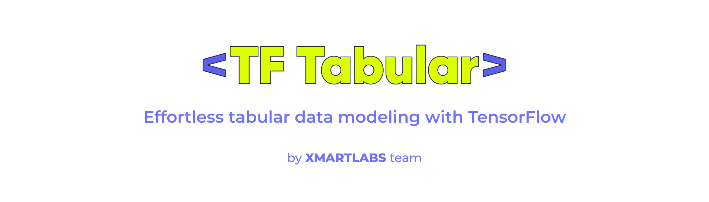

# TF Tabular

TF Tabular is a project aimed at simplifying the process of handling tabular data in TensorFlow. It provides utilities for building models on top of numeric, categorical, multihot, and sequential data types.

## Features

- **Create input layers based on lists of columns**
- **Support custom embeddings**: Useful for including external embeddings for example obtained from an LLM.
- **Support sequence layers**: Useful for time series or when building recommenders on top of user interaction data.
- **Support multi-hot categorical columns**
- **No model building or training**: Build whatever you want on top


## Installation

To get started with TF Tabular, you will need to install it using pip:

```sh
pip install tabular-tf
```

## Usage

Here is a basic example of how to use TF Tabular:

```python
from tf_tabular.builder import InputBuilder

# Define columns to use and specify additional parameters:
categoricals = ['Pclass', 'Embarked']
numericals = ['Age', 'Fare']
# ....

# Build model:
input_builder = InputBuilder()
input_builder.add_inputs_list(categoricals=categoricals,
                              numericals=numericals,
                              normalization_params=norm_params,
                              vocabs=vocabs,
                              embedding_dims=embedding_dims)
inputs, output = input_builder.build_input_layers()
output = Dense(1, activation='sigmoid')(output)

model = Model(inputs=inputs, outputs=output)
```

Which will produce a model like this:


## Examples
The **examples** folder includes more complete examples including:
* [Titanic](examples/titanic/titanic.ipynb): A simple binary classification example using the Titanic dataset.
* [MovieLens](examples/movielens/movielens.ipynb): A two tower retrieval model using the MovieLens dataset.
* [MovieLens Sequential](examples/sequential/movielens_sequential.ipynb): Another two tower retrieval model build on the MovieLens dataset preprocessed so that the input of the model is the list of movies the user has interacted with.


## Contributing
Contributions to TF Tabular are welcome. Check out the [contributing](https://github.com/xmartlabs/tf_tabular/blob/main/CONTRIBUTING.md) guidelines for more details.

### Setting up local development environment
To set up a local development environment, you will need to first clone the repo and then install the required dependencies:
1. Install Poetry follow the instructions on the [official Poetry website](https://python-poetry.org/docs/#installation).
2. Run `poetry install`
3. Run `poetry run pre-commit install` to install git pre-commit

## Roadmap:
This is a list of possible features to be added in the future depending on need and interest expressed by the community.

- [ ] Parse dataset to separate numeric vs categoricals, multihots and sequencials
- [ ] Implement other types of normalization
- [ ] Support computing vocab and normalization params instead of receiving them as parameters
- [ ] Improve documentation and provide more usage examples

## License
TF Tabular is licensed under the MIT License. See the LICENSE file for more details.
